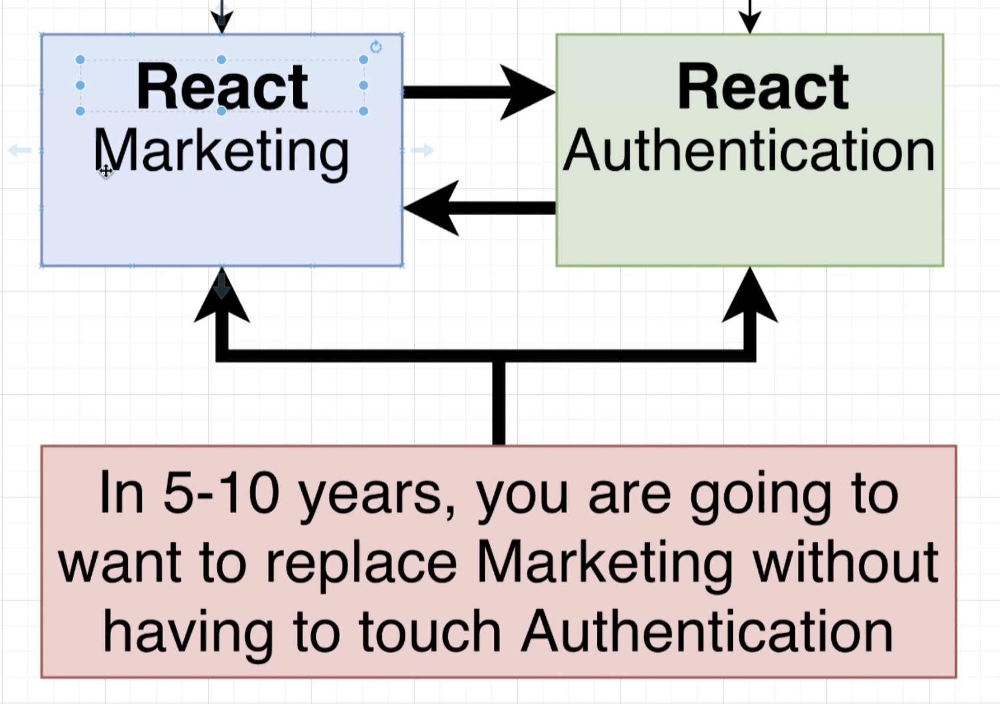

This is a learning repo and I have outlined my main concerns. This is going to a POC of my learnings and resolving these requirements

<!-- Run this to update TOC -->
<!-- npx @robb_j/md-toc -i -->

<!-- toc-head -->

## Table of contents

- [Basic Requirements](#basic-requirements)
  - [Zero coupling between child projects](#zero-coupling-between-child-projects)
  - [Near zero coupling between container & child apps](#near-zero-coupling-between-container--child-apps)
  - [CSS from one project shouldn't affect the other](#css-from-one-project-shouldnt-affect-the-other)
  - [Version control shouldn't have any impact on overall project](#version-control-shouldnt-have-any-impact-on-overall-project)
  - [Container can decide version to use](#container-can-decide-version-to-use)
  - [Must be able to develop locally](#must-be-able-to-develop-locally)
- [Important APIs](#important-apis)
  - [Import Maps](#import-maps)
- [Deployment requirements](#deployment-requirements)
  - [Deployment requirements](#deployment-requirements)
  - [CDN](#cdn)
  - [APIs should be lambdas](#apis-should-be-lambdas)
- [Routing requirements](#routing-requirements)
  - [Container + sub-apps require routing features](#container--sub-apps-require-routing-features)
  - [Sub apps need to add in new pages routes all the time](#sub-apps-need-to-add-in-new-pages-routes-all-the-time)
  - [We might need to show two or more MFEs at the same time](#we-might-need-to-show-two-or-more-mfes-at-the-same-time)
  - [We want to use off-the-shelf routing solutions](#we-want-to-use-off-the-shelf-routing-solutions)
  - [We need navigation features for sub-apps in both hosted & isolation mode](#we-need-navigation-features-for-sub-apps-in-both-hosted--isolation-mode)
  - [Child app communication about routing must be generic](#child-app-communication-about-routing-must-be-generic)

<!-- toc-tail --> 

## Basic Requirements
### Zero coupling between child projects
* No importing of functions/objects/classes
* No shared state
* Share libraries through MF okay

### Near zero coupling between container & child apps
* Container shouldn't assume that a child is using a particular framework
* Any necessary communication done w/callbacks or simple events

### CSS from one project shouldn't affect the other
* All CSS is scoped to app

### Version control shouldn't have any impact on overall project
* It cannot matter if we use monorepo or multi-repo

### Container can decide version to use
* Container can always use the latest version of a child app
* Container can specify exactly what version of a child it wants to use

### Must be able to develop locally
* All code is double deployed
* Can work on ONLY your app and everything else is remote

## Important APIs
### Import Maps
* Should be an API call but can output static
* Should be dynamic, no human intervention should be required
* Sub-apps should be able to determine their own destiny
    * A/B testing
    * A build-time feature not dynamic
### (Optional) AWS
* Prove it works in a CDN

## Deployment requirements
### Deployment requirements
* Want to deploy each microfrontend independently (including container)
* Location of child app must be known at build time
* Can handle deploying multiple projects

### CDN
* Apps are not containerized (Can be at edge)

### APIs should be lambdas
* They are cheap
* They don't need to live long

## Routing requirements
### Container + sub-apps require routing features
* Users can navigate around to different sub apps using routing logic built into the container
* Users can navigate around _IN_ a subapp using routing logic built into the subapp itself
* Not all sub-apps will require routing

### Sub apps need to add in new pages routes all the time
* New routes added to a subapp shouldn't require a redeploy of the container

### We might need to show two or more MFEs at the same time
* This will occur all the time if we have some kind of sidebar nav that is built a a separate microfrontend

### We want to use off-the-shelf routing solutions
* Building a routing library can be hard, let's not do that shit
* Some amount of custom code will be required, we're okay with that

### We need navigation features for sub-apps in both hosted & isolation mode
* Developing for each environment should be easy
    * A dev should be immediately be able to see what path they are visiting

### Child app communication about routing must be generic
If different apps need to communicate info about routing it should be done in as generic fashion as possible
* Each app might be using a completely different navigation framework
* We might swap out or upgrade navigation libraries all the time, shouldn't require a rewrite of the rest of the app

## Context requirements
* The container must be able to give components context
* The application must be able to handle that context
    * ex: Different header depending on:
        - Route
        - Permissions
        - Logged in status
* Container _may_ allow for global state
    * But must be immutable
    * Not meant for component state