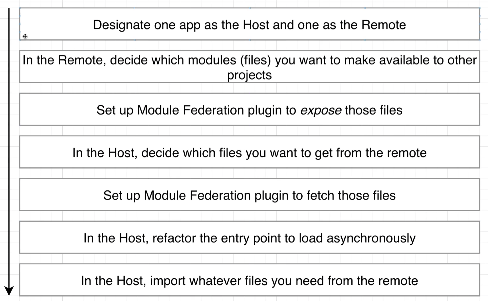
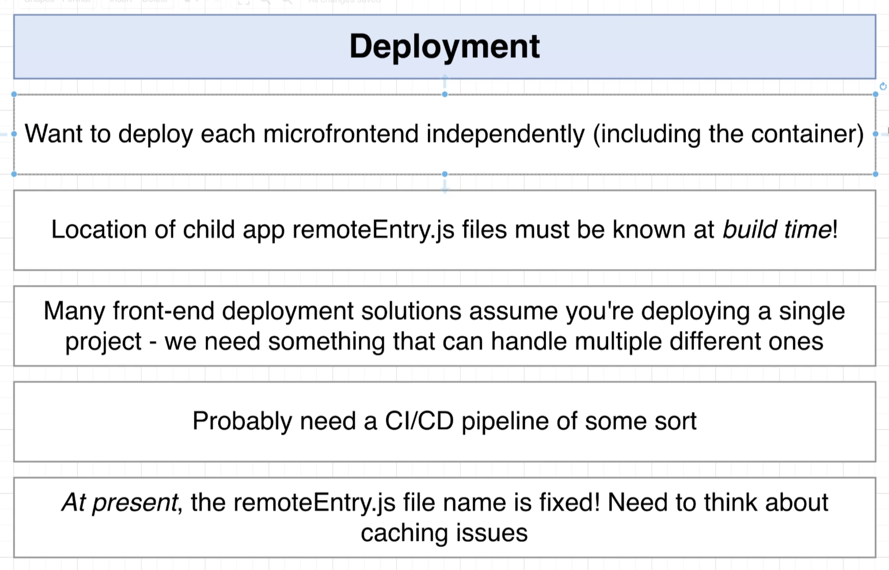
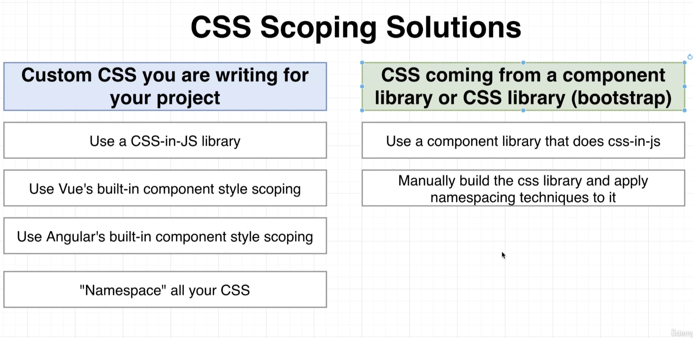

## Links for important shit

- [Root Config](https://single-spa.js.org/docs/configuration/)
- [Components](https://single-spa.js.org/docs/building-applications)
- [The Recommended Setup](https://single-spa.js.org/docs/recommended-setup/)
  - [`single-spa` local development](https://single-spa.js.org/docs/recommended-setup/#local-development) (within the doc linked above)
- [E2E Testing](https://single-spa.js.org/docs/testing/e2e)
- [https://github.com/nitinreddy3/react-ng-spa-app](https://github.com/nitinreddy3/react-ng-spa-app)
  - a multi-framework example with React and Angular. This app uses routes to render the React and Angular apps
- [https://github.com/Svelte-React-Vue-Angular-SPA](https://github.com/Svelte-React-Vue-Angular-SPA)
  - a multi-framework example with Svelte, React, Angular and Vue. This single spa uses single-spa-router.
- [single-spa example: Shared styled-components](https://github.com/filoxo/single-spa-example-shared-styled-components)
- [single-spa Examples](https://github.com/daniloesk/single-spa-examples)
- [single-spa example: Rxjs shared state](https://github.com/filoxo/single-spa-example-rxjs-shared-state)
- [single-spa example with Webpack `lazyStyleTag`](https://github.com/filoxo/single-spa-example-webpack-lazystyletag)

---

## Diagrams

How MFEs work

Deployemnt Requirements

CSS Scoping solutions

